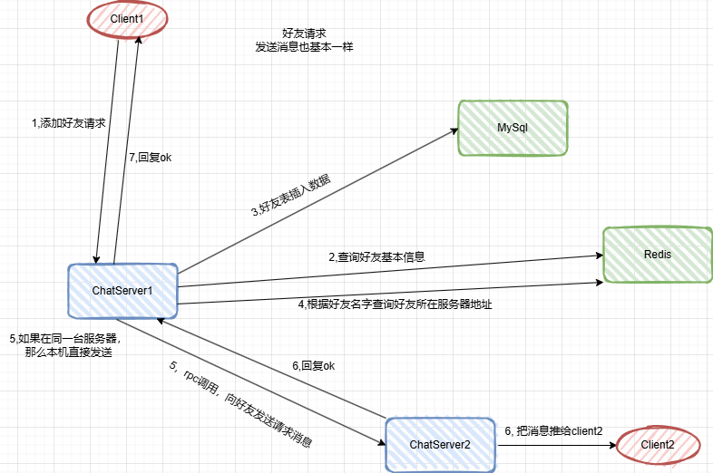

# CChat

恋恋风辰的全栈聊天项目

## 需要的第三方库

- hiredis
- mysqlconnector_c++
- protobuf + grpc [参考](https://llfc.club/category?catid=225RaiVNI8pFDD5L4m807g7ZwmF#!aid/2eIaoR0NBxxirmXKdzcke9vJxmP)
- jsoncpp 1.92
- boost

## 编译

 需要支持C++20

```shell
bash build.sh Debug
# 或
bash build.sh Release
```

## 运行

在`bin/`下找到可执行文件，直接运行即可

## 登陆流程


## 请求好友和聊天流程

